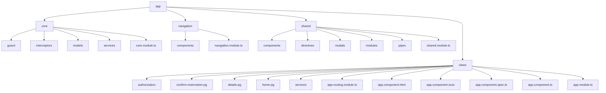

# AirbnbCloneNgDigital

This project was generated with [Angular CLI](https://github.com/angular/angular-cli) version 17.0.5.

## Getting Started

These instructions will get you a copy of the project up and running on your local machine for development and testing purposes.

### Prerequisites

What things you need to install the software and how to install them:

```bash
node -v // Check if Node.js is installed
npm -v // Check if npm is installed
```

## Installation

A step-by-step series of examples that tell you how to get a development environment running:

1. **Clone the repository**

    ```bash
    git clone https://github.com/yourusername/yourprojectname.git

    ```

2. **Navigate to the project directory**

`cd airbnb-clone-ng-digital`

3. **Install dependencies**

`npm install`

## Application structure

-   implemented lazy loading
-   SCSS is used for Styles



## Libraries

-   ngneat/until-destroy - provides a way to manage subscriptions automatically
-   angular material
-   rxjs

#Author

Giorgi Bidzishvili

## License

[MIT License](LICENSE)
